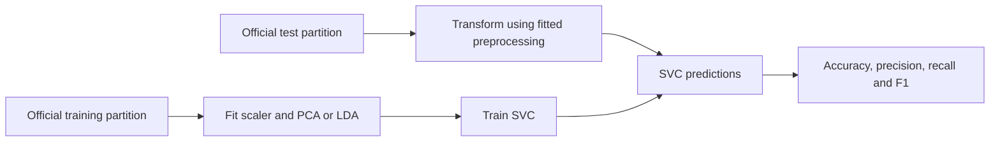

# Human Activity Recognition

I compare PCA and LDA representations with SVC for classifying sensor-based human activities.

## Run

Use a Python virtual environment. Install `pip install -r requirements.txt`, launch `jupyter notebook`, and open `human-activity-recognition.ipynb`. Run cells from top to bottom. Extract the UCI HAR dataset into data/UCI HAR Dataset or set HAR_DATASET_DIR.

## Scope and limitations

The official training/test partitions stay separate. Scaling, PCA and LDA fit the training partition only. The external dataset is not bundled, and a complete notebook run requires these files.

## Dataset

[Human Activity Recognition Using Smartphones — UCI](https://archive.ics.uci.edu/dataset/240/humanactivityrecognitionusingsmartphones). Reyes-Ortiz et al., DOI: 10.24432/C54S4K.

## Request flow

